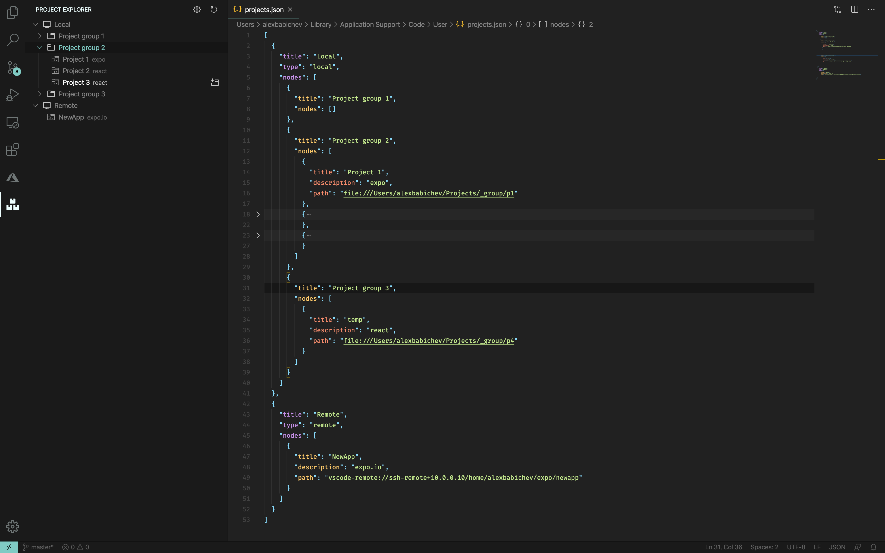

# Another Project Manager



**Project Manager** is an extension created for **Visual Studio Code**. If you find it useful, please consider supporting it.

It helps you to easily access your **projects**, no matter where they are located. _Don't miss that important projects anymore_. 

Here are some of the features that **Another Project Manager** provides:
* Open **local** and **remote** projects
* Open projects in the same or new window
* A dedicated **Side Bar**
* Easy configuration using JSON

For easier customization of your project list, you can edit the `projects.json` file, directly inside **Code**. 


```json
[
  {
    "title": "Local",
    "type": "local",
    "nodes": [
      {
        "title": "Project group 1",
        "nodes": []
      },
      {
        "title": "Project group 2",
        "nodes": [
          {
            "title": "Project 1",
            "description": "expo",
            "path": "file:///Users/alexbabichev/Projects/_group/p1"
          },
          {
            "title": "Project 2",
            "description": "react",
            "path": "file:///Users/alexbabichev/Projects/_group/p2"
          },
          {
            "title": "Project 3",
            "description": "react",
            "path": "file:///Users/alexbabichev/Projects/_group/p3"
          }
        ]
      },
      {
        "title": "Project group 3",
        "nodes": [
          {
            "title": "temp",
            "description": "react",
            "path": "file:///Users/alexbabichev/Projects/_group/p4"
          }
        ]
      }
    ]
  },
  {
    "title": "Remote",
    "type": "remote",
    "nodes": [
      {
        "title": "NewApp",
        "description": "expo.io",
        "path": "vscode-remote://ssh-remote+10.0.0.10/home/alexbabichev/expo/newapp"
      }
    ]
  }
]
```
